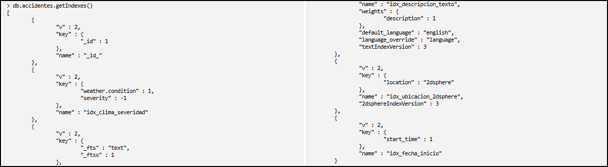
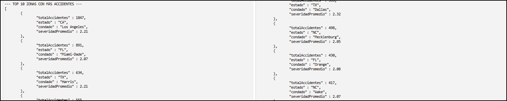
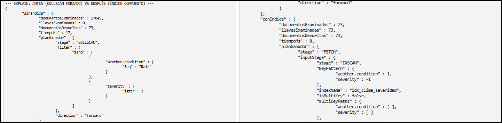
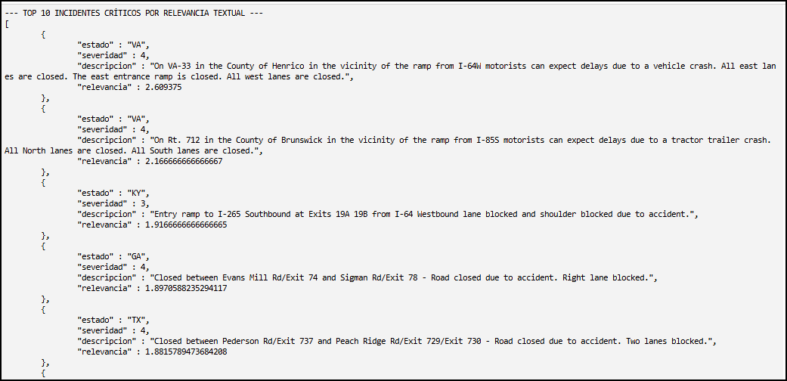
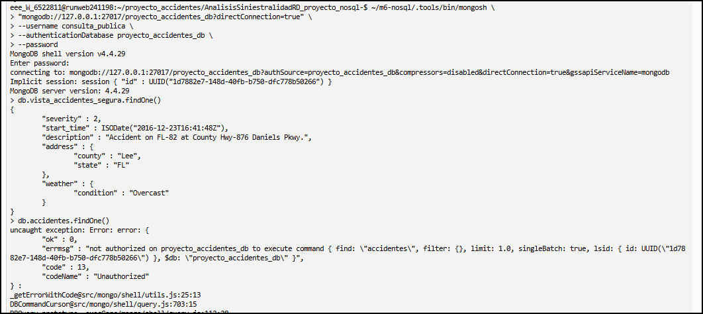

# Análisis de Siniestralidad Vial con MongoDB

Proyecto final del **Módulo 6** del *Diplomado en Manejo de Bases de Datos SQL y NoSQL en un Entorno de Nube* (FC–IIMAS, UNAM).

El proyecto modela, carga, valida, indexa y analiza una colección documental de accidentes viales. Integra **agregaciones, índices, validación, análisis temporal y textual, minimización de datos y privilegio mínimo**.

> **Fuente:** *US Accidents (2016–2023)*, Sobhan Moosavi (Kaggle). Se trabajó con una muestra de **27,049 registros**. Los resultados describen esta muestra para el proyecto
---

## Problema, usuarios y preguntas

Los datos en bruto no permiten reconocer con facilidad dónde, cuándo y bajo qué condiciones se concentra el riesgo. Los resultados están dirigidos a analistas de vialidad, dependencias de tránsito y equipos de respuesta a emergencias.

1. ¿Cuáles son las zonas con mayor frecuencia y severidad promedio de accidentes?
2. ¿Cuáles son los meses que concentran más accidentes y mayor severidad?
3. ¿En qué horarios y condiciones de luz ocurren más accidentes?
4. ¿Cómo se relacionan las condiciones climáticas con la severidad?
5. ¿Qué accidentes de alta severidad son más relevantes para términos asociados con bloqueos y cierres viales?

La Pregunta 5 utiliza **relevancia textual con `$text` y `textScore`**; no calcula frecuencia global de palabras ni búsqueda semántica/vectorial.

---

## Modelo documental

La colección principal es `accidentes`.

| Campo | Diseño | Uso |
|---|---|---|
| `severity` | `int`, escala 1–4 | Métricas y validación |
| `start_time` | BSON `Date` | Rangos y agrupaciones temporales |
| `location` | GeoJSON `Point [lng, lat]` | Índice `2dsphere` |
| `address`, `weather`, `road_features` | Subdocumentos embebidos | Lectura conjunta con el accidente |
| `description` | Texto libre | Índice `text` y `$text` |

### Nota temporal

El flujo conserva una representación uniforme con sufijo `Z`. Esto **no demuestra una conversión desde la zona horaria local original de cada estado**, por lo que el análisis horario se interpreta sobre la representación almacenada.

---

## Orden de ejecución

1. Preparar `accidentes_mongo.jsonl` con `transformar_a_mongo.py` si se parte del CSV.
2. Cargar los 27,049 documentos.
3. Ejecutar `consultas/00_indices_y_validacion.js`.
4. Ejecutar `seguridad/vista_publica.js` y `seguridad/roles_y_usuarios.js` con control de acceso habilitado.
5. Ejecutar `consultas/p1_zonas_riesgo.js` a `consultas/p5_busqueda_textual.js`.

### Carga en Learner Lab sin `mongoimport`

El repositorio incluye `importar_jsonl.py`, que solicita la contraseña sin almacenarla:

```bash
python3 importar_jsonl.py
```

Resultado verificado:

```text
IMPORTACIÓN TERMINADA: 27049 documentos
Conteo MongoDB: 27049
```

Si `mongoimport` está disponible también puede utilizarse; el script Python se conserva como alternativa reproducible para el Learner Lab utilizado.

---

## Índices y validación

Los nombres se mantienen en español; los campos conservan sus nombres originales del dataset.

```javascript
{ "weather.condition": 1, severity: -1 } // idx_clima_severidad
{ description: "text" }                 // idx_descripcion_texto
{ location: "2dsphere" }                // idx_ubicacion_2dsphere
{ start_time: 1 }                        // idx_fecha_inicio
```

`db.accidentes.getIndexes()` comprobó la existencia de los cuatro índices.



El `$jsonSchema` exige:

- `severity`: BSON `int`, rango 1–4.
- `start_time`: BSON `date`.
- `location`: objeto GeoJSON `Point` con `coordinates`.

Pruebas verificadas:

```text
OK: el documento válido fue aceptado.
OK: el documento inválido fue rechazado por el validador.
Código esperado de validación: 121
```

---

## Pregunta 1 — Zonas con mayor volumen

`p1_zonas_riesgo.js` agrupa por `address.state` y `address.county`, calcula total y severidad promedio y ordena por volumen.

Resultados principales:

| Zona | Accidentes | Severidad promedio |
|---|---:|---:|
| Los Angeles, CA | 1,847 | 2.21 |
| Miami-Dade, FL | 891 | 2.07 |
| Harris, TX | 634 | 2.21 |
| Dallas, TX | 555 | 2.32 |

La consulta es **geográfica por atributos**, no geoespacial; no utiliza `location` ni operadores como `$near` o `$geoWithin`.



---

## Pregunta 2 — Estacionalidad e intervalo temporal

La prueba por intervalo usa la convención `[inicio, fin)`:

```javascript
start_time: {
  $gte: ISODate("2022-01-01T00:00:00Z"),
  $lt: ISODate("2022-02-01T00:00:00Z")
}
```

Con `idx_fecha_inicio` y `explain("executionStats")` se obtuvo:

```text
documentosDevueltos: 476
documentosExaminados: 476
llavesExaminadas: 476
plan: IXSCAN
indexName: idx_fecha_inicio
```

Meses con mayor volumen:

1. Diciembre — **2,951**
2. Enero — **2,638**
3. Noviembre — **2,621**

---

## Pregunta 3 — Horarios y luz

Mayores concentraciones observadas:

| Hora | Accidentes | Luz | Severidad promedio |
|---|---:|---|---:|
| 08:00 | 2,038 | Day | 2.19 |
| 16:00 | 1,934 | Day | 2.21 |
| 07:00 | 1,827 | Day | 2.19 |
| 15:00 | 1,820 | Day | 2.20 |

Estos horarios corresponden a la representación temporal almacenada; no se afirma una reconstrucción de hora local por estado.

---

## Pregunta 4 — Clima y rendimiento

El pipeline compara condiciones climáticas mediante total de accidentes, severidad promedio, número de accidentes con `severity >= 3` y porcentaje de alta severidad.

Ejemplos medidos:

| Condición | Total | Alta severidad | % alta severidad |
|---|---:|---:|---:|
| Fair | 8,910 | 1,022 | 11.47% |
| Clear | 2,757 | 922 | 33.44% |
| Mostly Cloudy | 3,462 | 747 | 21.58% |
| Overcast | 1,349 | 478 | 35.43% |
| Rain | 295 | 73 | 24.75% |

### `COLLSCAN` vs `IXSCAN`

Para:

```javascript
{ "weather.condition": "Rain", severity: { $gte: 3 } }
```

se comprobó:

| Plan | Docs examinados | Llaves | Devueltos |
|---|---:|---:|---:|
| `COLLSCAN` forzado | 27,049 | 0 | 73 |
| `IXSCAN` con `idx_clima_severidad` | 73 | 73 | 73 |



Se reportan los valores medidos; no se afirma un “100% de eficiencia” ni una reducción exponencial sin una métrica formal.

---

## Pregunta 5 — Relevancia textual

```javascript
$text: { $search: "blocked lane ramp closed" }
```

se combina con `severity >= 3`, se proyecta `$meta: "textScore"` y se ordena por **relevancia textual**.



Se prefirió `$text` frente a un `$regex` no anclado porque el proyecto necesita búsqueda de lenguaje libre con índice especializado y ranking por `textScore`.

---

## Componente geoespacial

`location` conserva GeoJSON `Point` y `idx_ubicacion_2dsphere`. El índice queda listo para futuras extensiones con `$near`, `$geoWithin` o `$geoIntersects`, pero no se fuerza su uso en las cinco preguntas actuales porque los componentes temporal y textual responden mejor al problema delimitado.

---

## Seguridad, privacidad y privilegio mínimo

### Clasificación y minimización

| Campo | Nivel |
|---|---|
| `address.state`, `address.county`, `weather.*`, `severity` | Público |
| `location`, `address.street` | Interno / cuasi-identificador |
| `description` | Interno, texto libre |

`vista_accidentes_segura` excluye `location` y `address.street`.

### Roles

| Rol / usuario | Acciones | Recurso |
|---|---|---|
| `RolAdminRiesgo` / `admin_riesgo` | `find`, `insert`, `update`, `remove` | `accidentes` |
| `RolAnalistaLectura` / `analista_vial` | `find` | `accidentes` |
| `RolConsultaPublica` / `consulta_publica` | `find` | `vista_accidentes_segura` |

Las contraseñas no están hardcodeadas; `roles_y_usuarios.js` utiliza:

```javascript
pwd: passwordPrompt()
```

### Denegaciones comprobadas

En la ejecución final MongoDB se levantó con control de acceso habilitado (`--auth`). Se verificó que:

- `consulta_publica` **sí** puede consultar `vista_accidentes_segura`.
- `consulta_publica` recibe `Unauthorized` al consultar `accidentes`.
- `analista_vial` **sí** puede leer `accidentes`.
- `analista_vial` recibe `Unauthorized` al intentar insertar.



---

## Resultados, límites y mejora

### Resultados principales

- 27,049 documentos cargados y verificados.
- Los Angeles, CA: 1,847 accidentes, mayor volumen de la muestra.
- Diciembre: 2,951 accidentes; enero: 2,638; noviembre: 2,621.
- 08:00: 2,038 accidentes; 16:00: 1,934.
- Overcast presentó 35.43% de alta severidad dentro de su categoría.
- La consulta Rain + severity >= 3 pasó de 27,049 documentos examinados con `COLLSCAN` a 73 con `IXSCAN`.
- La vista pública y las restricciones de escritura/lectura fueron comprobadas con denegaciones reales.

### Límites

- Muestra estática: análisis descriptivo, no predicción en tiempo real.
- No se reconstruye la zona horaria local original por estado.
- `2dsphere` está preparado, pero no forma parte de las cinco consultas actuales.

### Mejora propuesta

Implementar colecciones **Time Series** de MongoDB, conservar la zona horaria de origen de cada evento e integrar la base con una herramienta de BI para monitoreo dinámico.
